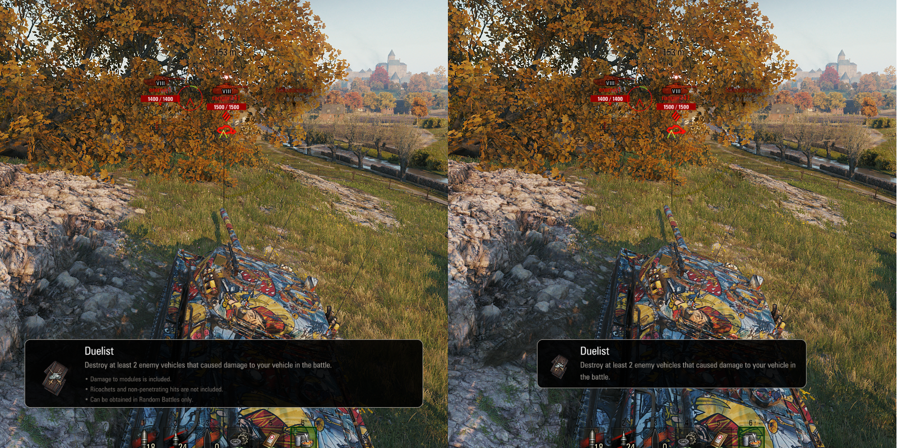
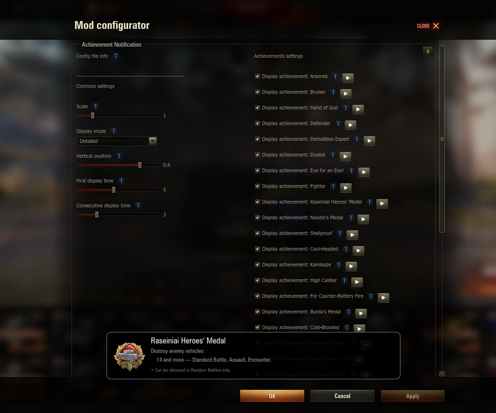

## Achievement Notification
A mod displaying configurable achievement notification during battle.

Features:
* displaying most possible achievements to get
* displaying asterisk (*) on some achievements indicating uncertainty of some survive/win/being top conditions
* configurable display mode (compact, detailed) vertical position and display length
* ability do enable/disable specific achievements

Configurable using Mod Configurator by IzeBerg
**using "<>" button in right-bottom corner in the garage**.

## Download sites
Here are websites, where mod is uploaded directly by me:
* [WG Mods](https://wgmods.net/7081/)
* [GitHub release page](https://github.com/Pruszko/AchievementNotification/releases)

## Installation
Copy "AchievementNotification_X.wotmod" and other "*.wotmod" files extracted
from downloaded zip into "[WoT game directory]/mods/[version]/" directory

Config file location:  
* [WoT game directory]/mods/configs/AchievementNotification/config.json

## Contributions
Thanks to:
* IzeBerg - for cool GUI configuration API
* POLIROID - for ModsListAPI
* AVPromo & AssTrahanec - for Russian translations & pull request